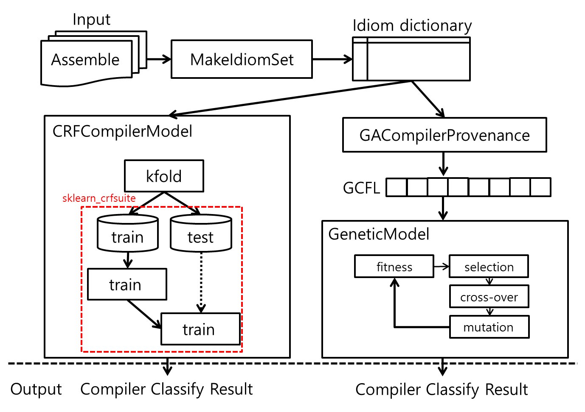

# GACompilerClassifier
- #### 목적 : 
    - 여러 악성코드 식별 방법 중 Authorship Attribution 방법을 이용하여 악성코드를 식별 및 예방하려고 한다.
    - Authorship Attribution 방법을 이용하여 악성코드를 분류하기 위한 여러 특징들이 존재한다. 예를 들어, 코드 작성 스타일, 코드 문법, 컴파일러 정보 등이 있다.
    - 본 연구에서는 여러 특징 중에서 바이너리 코드(or 어셈블 코드)로부터 정적 분석을 통해 컴파일러 정보를 추출하는 것에 대해 서술하였다.
    - 특히, 컴파일러 정보 중 컴파일러 패밀리에 대한 정보를 추출하며, GCC, ICC, MSVC, XCODE 4개로 컴파일러를 분류하려고 한다.
--------------------------------------
- #### 선행 연구 기술 분석 : 
    - Main Idea : 
        - Function Entry Point 를 찾는다.
        - FEP를 비교한다.
        - 패턴을 분석한다.
        - 분석된 내용을 기반으로 Compiler Family 를 구별한다. 
    - Context 기반 : Idiom + wildcard + n-gram(size : 3)
    - Structure 기반(Negative Value) : 
        - Call-Consistency Feature : Entry 안에 'Call'이 포함된 여부
        - Binary Overlap Feature : Entry 안에 기존 바이트코드와 비슷한 코드가 있는지 여부
    - Model : 
        - Conditional Random Field : 연속적인 입력에 대한 연속적인 분류 추론 방법
    - Ref : 
        - Rosenblum Nathan, Xiaojin Zhu, Barton Miller, "Learning to Analyze Binary Computer Code." AAAI. 2008.
        - Rosenblum Nathan, Barton Miller, Xiaojin Zhu, "Extracting Compiler Provenance from Program Binaries", Proceedings of the 9th ACM SIGPLAN-SIGSOFT workshop on Program analysis for software tools and engineering. ACM, 2010.
-------------------------------------
- #### 연구 프로젝트 목표 : 
    - "Assembly Code"로 부터 Instruction Code를 찾아 "Idiom 특징"을 가진 데이터 세트로 처리한다.
    - 선행 연구와 같이 Linear-chain CRF 모델을 이용하여 컴파일러를 분류한다.
    - 제안된 방법인 Genetic Compiler Feature List 방법을 통해 "Assembly Code"로 부터 특징을 추출한다.
    - Genetic Algorithm 모델을 정의하고 GCFL 특징을 통해 컴파일러를 분류한다.
------------------------------------- 
- #### 시스템 설명 : 

    
    
    - ~~DataLoader Class : Assembly Code와 Hex Code를 통해 Idiom 특징 및 해당 hex 코드를 통합한 데이터 세트를 만든다.~~
    - MakeIdiomSet Class : Assembly Code에서 Instruction Code를 찾아 "Idiom 특징"을 가진 데이터 세트를 만든다.
        ```
        makeIdiom = MakeIdiomSet()
        ```
        - directoryToIdiom(uri=None, compiler=None)
            ```
            gcc_idiom_dict = makeIdiom.directoryToIdiom(uri="./data/gcj_text/ass/gcc/", compiler=type_array[0])
            ```
            - explain : 디렉토리의 파일을 읽어와 idiom 특징을 추출하여 dictionary 로 추출한다.
            - input : 
                - uri : 디렉토리 경로
                - compiler : 읽은 파일의 컴파일러 Label 정의
            - output : idiom 특징을 추출한 dictionary 결과
            
        - fileLoad(filename=None, compiler=None)
             ```
             gcc_idiom_dict = makeIdiom.fileLoad(uri="./data/gcj_text/ass/gcc/gcc-2.exe.txt", compiler=type_array[0])
             ```
            - explain : 파일을 읽어와 idiom 특징을 추출하여 dictionary 로 추출한다.
            - input : 
                - filename : 읽을 파일 경로 + 이름
                - compiler : 읽은 파일의 컴파일러 Label 정의
            - output : idiom 특징을 추출한 dictionary 결과
            
        - def checkDict(dict_list)
            ```
             makeIdiom.checkDict(dict_list=gcc_idiom_dict)
             ```
            - explain : idiom 특징을 추출한 dictionary 결과를 출력한다.
            - input : 
                - dict_list : idiom 특징을 추출한 dictionary 결과
            - output : None
            
        - def saveIdiomDict(dict_list, type, save_url)
            ```
            makeIdiom.saveIdiomDict(save_url="./data/idiom/", dict_list=gcc_idiom_dict, type=type_array[0])
            ```
            - explain : idiom 특징을 추출한 dictionary 결과를 csv 파일로 저장한다.
            - input : 
                - dict_list : idiom 특징을 추출한 dictionary 결과
                - save_url : 저장할 위치
                - type : 읽은 파일의 컴파일러 Label
            - output : None
    
    - CRFCompilerModel Class : 선행 연구와 동일한 방법으로 Linear-chain CRF 모델을 정의하고 Idiom 특징을 통해 컴파일러를 분류한다.
        ```
        crfModel = CRFCompilerModel()
        ```
        - def dictToXY(dict, type)
             ```
             X, y = crfModel.dictToXY(item_dict, target)
             ```
            - explain : idiom dictionary 데이터로 부터 idiom 특징과 label을 구분한다.
            - input : 
                - dict : idiom dictionary 데이터
                - type : 읽은 파일의 컴파일러 Label
            - output :
                - X : 특징 데이터
                - y : Label 데이터
            
        - def kfold(dict, k, index)
            ```
            fold = 5
            for index in range(0, fold, 1):
              gcc_train, gcc_test = crfModel.kfold(dict=gcc_idiom_dict, k=fold, index=index)
            ```
            - explain : k-fold validation 을 위해 데이터를 나눈다.
            - input : 
                - dict : idiom dictionary 데이터
                - k : k-fold validation을 위해 나눌 크기  (ex 5 )
                - index : k-fold 구분 순서 (ex 0, 1, 2, 3...)
            - output : 
                - train : 훈련 데이터 세트
                - test : 테스트 데이터 세트
        
        - def train(train_x, train_y, epo=30)
            ```
            crfModel.train(train_x=train_x, train_y=train_y)
            ```
            - input : 
                - train_x : 훈련 특징 데이터
                - train_y : 훈련 Label 데이터
                - epo : 학습 반복 횟수
            - output : None
            
        - def getLabels()
            ```
            labels = crfModel.getLabels()
            ```
            - explain : 학습된 모델에서 분류한 label 데이터를 반환한다.
            - input : None
            - output : 학습된 Label 데이터
            
        - def test(test_x, test_y, labels, epo=30)
            ```
            accuracy, pred = crfModel.test(test_x=test_x, test_y=test_y, labels=labels)
            ```
            - input : 
                - test_x : 테스트 특징 데이터
                - test_y : 테스트 Label 데이터
                - labels : 학습된 Label 데이터
            - output :
                - accuracy : f-measure 측정 정확도 데이터
                - pred : 분류 예측한 컴파일러 Label 데이터
            
    - GACompilerProvenance : 추출된 Idiom 특징을 분석하여 입력 데이터(Assembly Code)들로부터 GCFL을 정의한다.
         ```
        gacp = GACompilerProvenance()
        ```
        
        - def dictToXY(dict, type)
             ```
             X, y = crfModel.dictToXY(item_dict, target)
             ```
            - explain : idiom dictionary 데이터로 부터 idiom 특징과 label을 구분한다.
            - input : 
                - dict : idiom dictionary 데이터
                - type : 읽은 파일의 컴파일러 Label
            - output :
                - X : 특징 데이터
                - y : Label 데이터
                
        - def kfold(list, k, index)
            ```
            fold = 5
            for index in range(0, fold, 1):
              gcc_train, gcc_test = crfModel.kfold(dict=gcc_idiom_dict, k=fold, index=index)
            ```
            - explain : k-fold validation 을 위해 데이터를 나눈다.
            - input : 
                - dict : idiom dictionary 데이터
                - k : k-fold validation을 위해 나눌 크기  (ex 5 )
                - index : k-fold 구분 순서 (ex 0, 1, 2, 3...)
            - output : 
                - train : 훈련 데이터 세트
                - test : 테스트 데이터 세트
                
        - def mergeIdiom(x)
            ```
            gacp.mergeIdiom(train_x)
            ```
            - explain : 각 컴파일러 Label 별 idiom dictionary 데이터를 합친다.
            - input : 
                - x : idiom dictionary 데이터
            - output : None
            
        - def calcImpactIdiom(label_size, gcf_size)
            ```
            chrom_feature_list = gacp.calcImpactIdiom(label_size=4, gcf_size=gcf_define_size)
            ```
            - explain : 
                - 합쳐진 merge dictionary 데이터를 통해 idiom 특징이 각 컴파일러에 주는 영향도를 측정한다.
                - 측정 방식은 유클리드 거리를 이용하며, 유클리드 값이 클수록 해당 해당 컴파일러에 영향도가 큼을 나타낸다.
            - input : 
                - label_size : 분류할 컴파일러 크기
                - gcf_size : GA Input 데이터로 이용할 chromosome의 크기 정의
            - output : 
                - chrom_feature_list : 통합된 idiom 특징의 각 컴파일러 영향도 측정 결과 데이터
        
        - def saveImpactIdiom(type, dic_url= "./data/idiom/")
            ```
            gacp.saveImpactIdiom(type = "gcc", dic_url = "./data/idiom/")
            ```
            - explain : 통합된 idiom 특징의 각 컴파일러 영향도 측정 결과를 저장한다.
            - input : 
                - type : 저장할 컴파일러 Label
                - dic_url : 저장할 위치
            - output : None
        
        - def makeChromosome(train_data_list)
            ```
            gcc_chromosome = gaModel.makeChromosome(train_data_list=gcc_train)
            ```
            - explain : 
                - Genetic Algorithm 의 input 값인 염색체(chromosome) 데이터로 변환하기 위해 이용한다.
                - 염색체 데이터로 변환하기 위해 GCFL을 기준으로 한다. GCFL의 각 value 값은 빈도수로 이다.
            - input : 
                - train_data_list : 훈련 데이터 (X, y 포함)
            - output : 
                - chromosome : GA Input 데이터로 이용할 chromosome 데이터
                
    - ~~GAModel : Genetic Algorithm 을 통해 입력된 GCFL 데이터로부터 최적의 GCFL 특징을 정의한다.~~
    
    - GeneticModel : Genetic Algorithm 을 통해 입력된 GCFL 데이터로부터 최적의 GCFL 특징을 정의한다.
        ```
         model = GeneticModel()
        ```
        - def run(self, chromo_origins=None, population_size=5)
            ```
            model.run(chromo_origins=gcc_chromosome, population_size=100)
            ```
            - explain : Genetic Algorithm 을 실행한다.
            - input : 
                - chromo_origins : 훈련 데이터(GCFL 기준 chromosome 특징 데이터)
                - population_size : 다음 세대인 자손세대 크기
            - output : None
            
        - def getMaxFit()
            ```
            gcc_max_fit = model.getMaxFit()
            ```
            - explain : Genetic Algorithm 훈련을 통해 얻은 최적의 fitness 값을 얻는다.
            - input : None
            - output : 최적의 fitness 값
        
        - def getOptimalGene():
            ```
             gcc_optimal_chromo = model.getOptimalGene()
            ```
            - explain : Genetic Algorithm 훈련을 통해 얻은 최적의 GCFL 값을 얻는다.
            - input : None
            - output : 최적의 GCFL 값
            
        - def showChromos(chromos)
            ```
            showChromos(gcc_optimal_chromo)
            ```
            - explain : Genetic Algorithm 의 chromosome 데이터를 출력한다.
            - input : 
                - chromos : chromosome 데이터 목록 (list)
            - output : None
            
        - def fit(x, y):
            ```
            model.fit(x=[gcc_optimal_chromo, icc_optimal_chromo, msvs_optimal_chromo, xcode_optimal_chromo],
                      y=[0, 1, 2, 3])
            ```
            - explain : 각 컴파일러의 GCFL 데이터를 GA 모델에 각 컴파일별 저장한다.
            - input : 
                - x : 각 컴파일러 데이터별 최적의 GCFL 값 (순서 : [gcc, icc, msvs, xcode])
                - y : 각 컴파일러 Label 데이터 (순서 : [gcc, icc, msvs, xcode])
            - output : None
        
        - def classifyAll(x)
            ```
            classify_total_y = model.classifyAll(x=test_chromo_x)
            ```
            - explain : 테스트 chromosome 데이터를 통해 전체 컴파일러 대상 예측 분류 데이터를 얻는다.
            - input : 
                - x : 테스트 chromosome 데이터
            - output : 
                - classify_total_y : 예측 분류 데이터
                
        - def classify(x, label)
            ```
            classify_total_y = model.classifyAll(x=test_chromo_x)
            ```
            - explain : 테스트 chromosome 데이터를 통해 특정 컴파일러 대상 예측 분류 데이터를 얻는다.
            - input : 
                - x : 테스트 chromosome 데이터
                - label : 분류할 컴파일러 Label 데이터
            - output : 
                - classify_total_y : 예측 분류 데이터
                
        - def evaluate(origin, classify)
            ```
            total_res = model.evaluate(total_label_test, classify_total_y)
            ```
            - explain : 예측 데이터와 테스트 컴파일러 데이터를 f-measure 방법을 통해 정확도를 산출한다.
            - input : 
                - origin : 테스트 컴파일러 Label 데이터
                - classify : GA 모델을 통해 얻은 예측 데이터
            - output : 
                - classify_total_y : 예측 분류 데이터
                
-------------------------------------
- #### 실행 환경 : 
    - python : 3.6 이상
    - anaconda : 1.7.2 이상
    - os : windows 10 edu
    - IDE : pycharm
    - External library : 
        - sklearn_crfsuite : ver 0.4.0 (CRFCompilerModel 사용 시)
        - pandas : ver 0.24.2 이상
        - numpy : ver 1.16.2 이상
-------------------------------------

- #### 오픈소스화 : 
    - 해당 프로젝트는 컴파일러 분류 연구를 바탕으로 제작되었습니다.
    - 그러나 프로젝트 내에 내포된 linear-chain CRF, GA, GCFL, Idiom feature 등 다양한 모델 및 특징 추출 방법에 대한 클래스 및 기능들은 다양한 분야의 연구에 응용될 수 있습니다.
    - 제작된 라이브러리 자체적으로 사용하셔도 좋으나, 연구 및 활용에 따라 수정하셔서 사용하는 것을 추천합니다.

-------------------------------------
#### Version
* ##### ver 0.0.1
    * DataLoader Class 정의
* ##### ver 0.0.2
    * MakeIdiomSet Class 정의
* ##### ver 0.0.3
    * CRFCompilerModel Class 정의
* ##### ver 0.1.0    
    * GACompilerProvenance Class 정의
    * GAModel Class 정의
    * MakeIdiomSet Class 수정
        * 명령 수행 과정에 대한 print 문 주석 처리
    * Main.py 수정
        * CRF, GCFL 수행 과정에 대해 runCRFModel(), runGAModel() 로 구분
* ##### ver 0.1.3    
    * DataLoader Class 삭제
    * GeneticModel Class 정의
* ##### ver 0.1.4   
    * GAModel Class 삭제
    
    
-----------------------------------------
```
GACompilerClassifier
Copyright (C) 2019  cheolhun hwang

This program is free software: you can redistribute it and/or modify
it under the terms of the GNU General Public License as published by
the Free Software Foundation, either version 3 of the License, or
(at your option) any later version.

This program is distributed in the hope that it will be useful,
but WITHOUT ANY WARRANTY; without even the implied warranty of
MERCHANTABILITY or FITNESS FOR A PARTICULAR PURPOSE.  See the
GNU General Public License for more details.

You should have received a copy of the GNU General Public License
along with this program.  If not, see <http://www.gnu.org/licenses/>.
```    